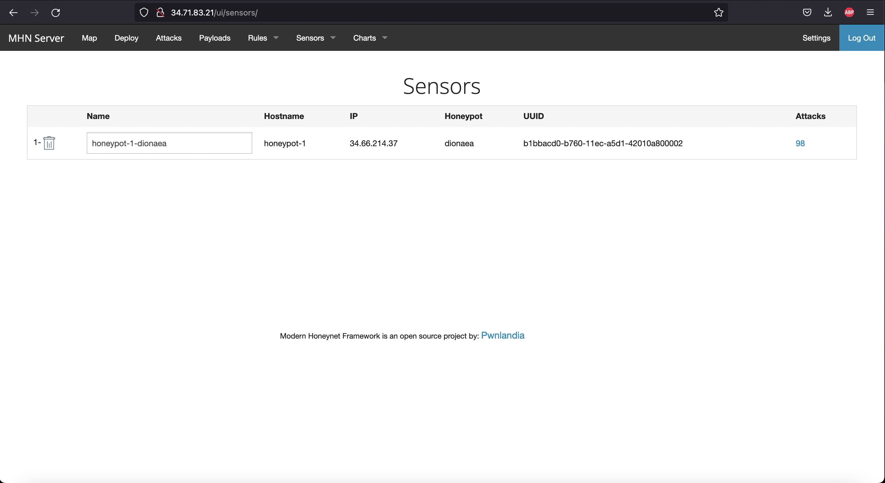

# Honeypot Assignment

**Time spent:** **5** hours spent in total

**Objective:** Create a honeynet using MHN-Admin. Present your findings as if you were requested to give a brief report of the current state of Internet security. Assume that your audience is a current employer who is questioning why the company should allocate anymore resources to the IT security team.

### MHN-Admin Deployment (Required)

**Summary:** Deployed using GCP using a series of commands from the assignment page.

### Dionaea Honeypot Deployment (Required)

**Summary:** Dionaea traps and captures any type of malware that attempts to connect to it. 

### Database Backup (Required) 

**Summary:** MHN-Admin uses MongoDB for its RDBMS. You can find this out because the command used to export the .json file uses a MongoDB call. The .json file includes all of the attacker's information when it comes to the time, IP, port, identifier, and which honeypot captured it. 

## Notes

I had to redo the entire project due to the mhn-admin page not capturing any attacks under the Attack tab even though on the Map, it showed attacks happening.
